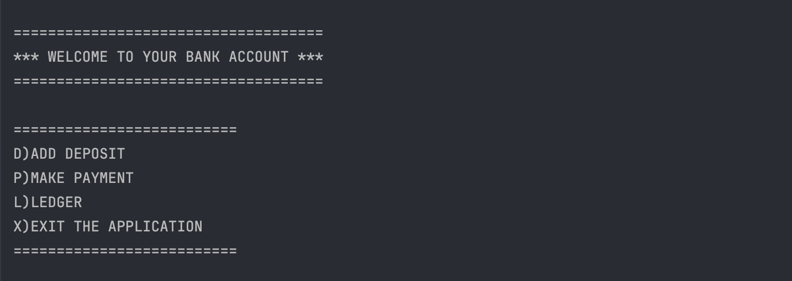
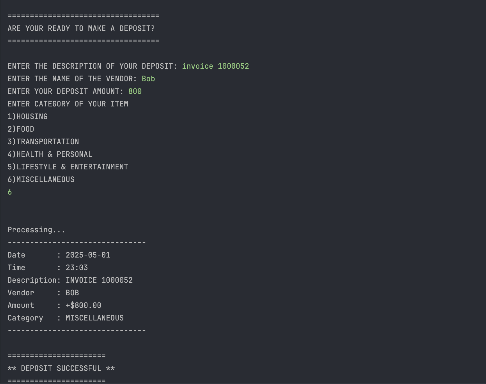
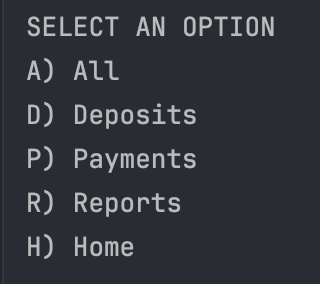
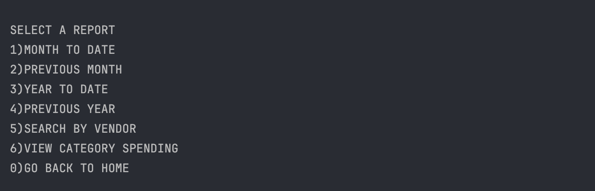
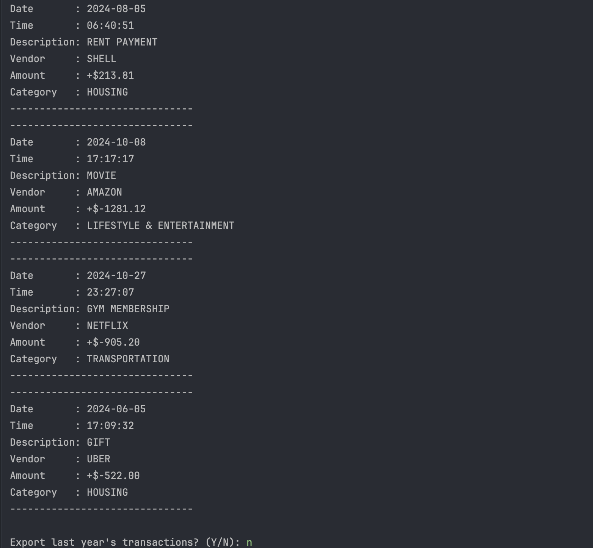

# CLI Finance Tracker

This is a Command-Line Interface (CLI) Java application for tracking personal or business financial transactions. It allows users to record deposits and payments, categorize spending, view reports, and even export summaries to `.txt` files — simulating a basic bank ledger.

---

## Features

###  Home Screen Options
- **D) Add Deposit**  
  Record income or deposits with description, vendor, amount, and category.
- **P) Make Payment**  
  Record expenses or payments (stored as negative amounts), with full detail.
- **L) Ledger**  
  View and filter all transactions.
- **X) Exit**  
  Exit the application.

---

###  Ledger View
Includes:
- **A) All** — View all transactions
- **D) Deposits** — View only deposits
- **P) Payments** — View only expenses
- **R) Reports** — Navigate to the reports menu
- **H) Home** — Return to the home menu

---

###  Reporting Features
- **Month to Date** — Shows all transactions from the start of the current month to today
- **Previous Month** — Shows transactions from the last full calendar month
- **Year to Date** — Shows all transactions from January 1st to today
- **Previous Year** — Shows all transactions from last calendar year
- **Search by Vendor** — Finds all transactions for a specific vendor
- **View Category Spending**
    -  Lets user select:
        - This month
        - This year
        - (With optional year/month input)
    -  Groups spending by category
    -  Exports report to `.txt` if requested

---

##  File Format

All transactions are stored in a file called transactions.txt
### Format (one line per transaction):

> Example: date | time | description | vendor | amount | category

---
##  Exported Reports

If the user chooses to export a report, it creates a new `.txt` file with:

- Title and date range
- Spending by category
- File name like: month-to-date-report-2025-01-01.txt
---

##  Categories Used

Transactions are categorized into 6 groups:

1. **Housing**
2. **Food**
3. **Transportation**
4. **Health & Personal**
5. **Lifestyle & Entertainment**
6. **Miscellaneous**

---

##  Technologies

- Language: **Java**
- No external dependencies — runs on standard Java SE
- File I/O: `BufferedReader` and `BufferedWriter`
- Date handling: `LocalDate`, `LocalTime`, `ChronoUnit`

---

##  Screens

###  Home Screen

###  Add Deposit

###  Ledger View

###  Report Menu

###  Export Confirmation

